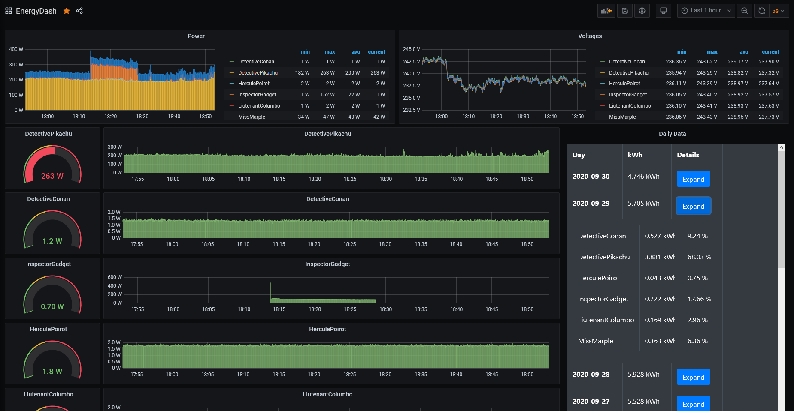

# Power Monitoring

My power monitoring setup/scripts using TP-Link HS110, Python, InfluxDB, Grafana




# Setup

This was installed on a raspberry pi.
Some commands may vary depending on raspbian/debian/ubuntu.

## HS110 check

These are using TP-Link HS110 devices.

__Warning__: The HS100 looks similar but it doesn't have power monitoring. Check before you buy.

I just set them up in the normal way using the Kasa app, although I think you can bootstrap them in isolated mode.  

## Install InfluxDB

From https://docs.influxdata.com/influxdb/v1.8/introduction/install/

```
wget -qO- https://repos.influxdata.com/influxdb.key | sudo apt-key add -
source /etc/os-release
echo "deb https://repos.influxdata.com/debian $(lsb_release -cs) stable" | sudo tee /etc/apt/sources.list.d/influxdb.list
sudo apt-get install influxdb
```

In my case influx service was started automatically, if not follow steps from above link for service configuration.

Then based on https://docs.influxdata.com/influxdb/v1.8/introduction/get-started/ login to influxdb and create the database.
In my case and used in scripts here it's database `EnergyDB`.

```
me@host:~ $ influx -precision rfc3339
Connected to http://localhost:8086 version 1.8.2
InfluxDB shell version: 1.8.2
> CREATE DATABASE EnergyDB
> SHOW DATABASES
name: databases
name
----
_internal
EnergyDB
> exit
``` 

## Install Grafana

From https://grafana.com/docs/grafana/latest/installation/debian/ follow "To install the latest OSS release":

```shell script
sudo apt-get install -y apt-transport-https
sudo apt-get install -y software-properties-common wget
wget -q -O - https://packages.grafana.com/gpg.key | sudo apt-key add -
echo "deb https://packages.grafana.com/oss/deb stable main" | sudo tee -a /etc/apt/sources.list.d/grafana.list 
sudo apt-get update
sudo apt-get install grafana
```

Login to Grafana at `http://HOSTNAME:3000/` where `HOSTNAME` = IP where you installed it

Configuration -> Data Sources -> Add data source -> InfluxDB
Set URL. I set it to `http://HOSTNAME:8086` since it's running on same server as Grafana. Add  

## Dependencies

To communicate with and get data from the HS110 plugs we use https://github.com/GadgetReactor/pyHS100
To send data to InfluxDB we use https://github.com/influxdata/influxdb-python

```shell script
pip install pyHS100
pip install influxdb
```

## List devices

Discover devices using either `pyhs100` command:

```
~ $ pyhs100
No host name given, trying discovery..
Discovering devices for 3 seconds
== DeviceLabel - HS110(EU) ==
Device state: ON
Host/IP: 192.168.XXX.XXX
On since: 2020-09-14 ........
LED state: True
== Generic information ==
Time:         2020-09-25 ....
Hardware:     4.0
Software:     1.0.4 Build 191111 Rel.143500
MAC (rssi):   AB:CD:EF:AC:CD:EF (-43)
Location:     {'latitude': XXXX, 'longitude': XXXX}
== Emeter ==
== Current State ==
{'power_mw': 4155, 'voltage_mv': 237051, 'current_ma': 214, 'total_wh': 412}
```

or using python snippet:
```python
from pyHS100 import Discover

for dev in Discover.discover().values():
    print(dev)

```

Note the Device IP addresses like `192.168.XXX.XXX`

## Feeding data into InfluxDB

- Copy [hs110toinflux.py](hs110toinflux.py) to somewhere on the system.
    - for example in user's home folder so it's `/home/USERNAME/hs110_influx_feed.py`
- set IP/Database of influx client `client = InfluxDBClient(host='192.168.XXX.XXX', database="EnergyDB")`
- set HS110 device IPs in `plug_ips = ["192.168.XXX.XXX", "192.168.XXX.XXX", "192.168.XXX.XXX"]`

### Set up data feeder as systemd user unit

create `/home/USERNAME/.config/systemd/user/hs110.service` containing:
```
[Unit]
AssertPathExists=/home/USERNAME/
Description=hs110 data collection

[Service]
WorkingDirectory=/home/USERNAME
ExecStart=/usr/bin/python3 /home/USERNAME/hs110_influx_feed.py
Restart=always

[Install]
WantedBy=default.target
```

Run commands:
```
# enable linger for user so service can start at boot time without interactive login
sudo loginctl enable-linger USERNAME
# reload service definitions
systemctl --user daemon-reload
# start the service
systemctl --user start hs110
# enable automatic startup of service on boot
systemctl --user enable hs110
```

Data should be fed into InfluxDB now.

## Grafana graphs

- Create->Dashboard
- Add new Panel
- in Query dropdown select EnergyDB data source
- in FROM change "select measurement" to "power"
- in SELECT change field(value) to field(power)
- you should already start seeing graph data showing milliwatts
- add more graphs, group by device, ask someone who knows grafana better
